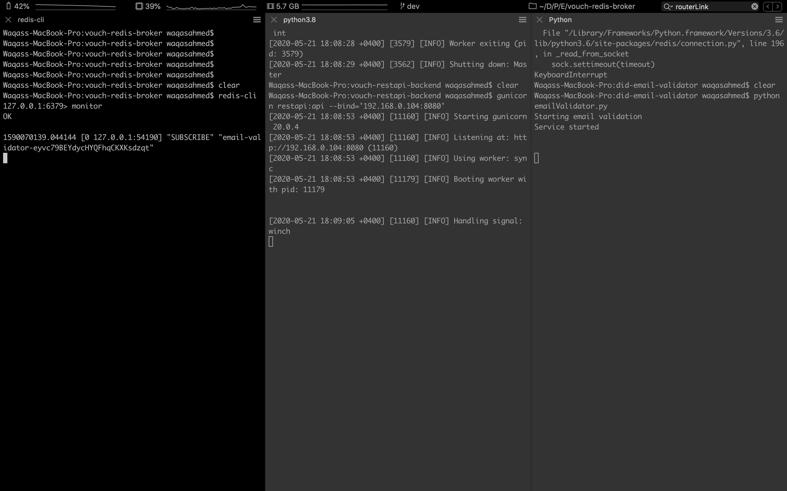

# vouch-dapp
KYC dApp for elastOS

# Pre-requsites (Mac based instructions)

1) Open first terminal and run the following commands:
```
$ redis-cli
127.0.0.1:6379> monitor
```
2) Open second terminal and run the following commands:
```
git clone https://github.com/tuum-tech/vouch-restapi-backend.git
cd vouch-restapi-backend
git checkout dev
```

Follow the README instructions to install the dependencies (along with mongodb) and then run the following:
`gunicorn restapi:api --bind='192.168.0.104:8080'` (Whitelisted Host in Vouch Capsule App)

3) Open third terminal and run the following commands:
```
git clone https://github.com/tuum-tech/did-email-validator.git
cd did-email-validator
git checkout dev
```

* Open `emailValidator.py` and change line#8 to the following:
```
callbackUrl = "http://192.168.0.104:8080/callback"
```
* Run the validator using the following command: `python emailValidator.py`


_Check the snapshot to see it in action_

# How to run the dApp?

`Make sure your android phone is connected to the system`

`Make sure you have elastOS app installed`

`FOR NOW UNTIL FIXED, Make sure you have playchat app installed`

Now, that all the above pre-requsites are up and running, run the following commands:

```
git clone https://github.com/tuum-tech/vouch-capsule.git
cd vouch-capsule
git checkout dev
trinity-cli run -p android
```

# About

This is a basic sample / quickstart application for **Elastos Trinity**. 

It's based on a simple ionic HTML5 tab application, but it also contains a default manifest file ready and is therefore 
ready to be packaged as a EPK file (Elastos Trinity package format), and ran inside the Trinity application (you have to 
install that application first on your mobile device).

Read more on [the Elastos developer website](https://developer.elastos.org) to learn more about building and running 
your own Trinity applications.
